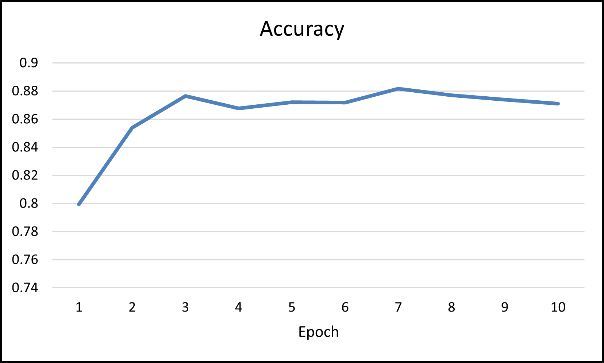
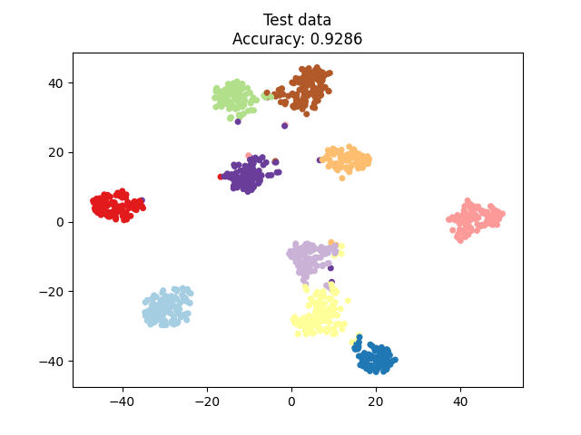

# Overview
- Algorithm of Deep learning clustering -> [Deep Embedded K-Means Clustering](https://arxiv.org/abs/2109.15149)
- official code -> https://github.com/spdj2271/DEKM

# Result (MNIST)
- Training Result  
Average accuracy of training data can reach over 85%, maximum can reach over 92%.  
model weight is at `./weight`


- Test Result


# Usage
```
python train.py -pre_epoch 15 -epoch 10 -k 10
```
- if your cuda memory is not enough, you should use less training data:  
add the command parameter `-take`, `-take 0.8` will only use 80% training data. 
```
python train.py -pre_epoch 15 -epoch 10 -k 10 -take 0.8
```

# Note
This repository is mainly for academic purposes.
